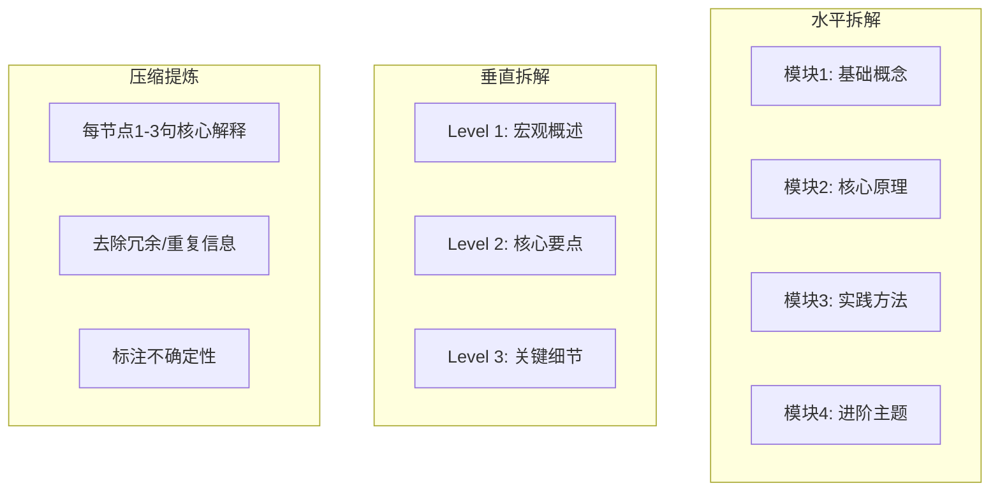

# 📐 知识结构化封装 Skill

融合技能管理KB的三点法 + 知识清单制作 + 渐进式披露设计哲学 + AI共演KB的分治-压缩-重组认知策略，形成一套完整的知识结构化方法论。

## 何时使用

适合以下场景：
- 你有一堆杂乱信息（笔记/资料/对话记录），想整理成清晰的知识体系
- 你需要制作一份知识清单/报告/教程，但不知从何下手
- 你需要把一个复杂问题讲清楚，但越讲越乱
- 你有经验想封装为可复用的SOP或Skill
- 你读完了一堆资料，需要输出结构化的总结

不适合：简单问答、纯数据处理、无需结构化的信息罗列

## 封装流程

### Phase 1：需求锁定

先明确三个问题：

| 问题 | 说明 | 示例 |
|------|------|------|
| **主题与范围** | 要整理什么领域？范围多大？ | "机器学习基础"（大领域）vs "Transformer注意力机制"（具体子话题） |
| **目标读者与深度** | 入门者还是专家？速查还是精讲？ | 入门级侧重点"是什么"，专业级深入"为什么"和"怎么做" |
| **素材来源** | 用户已提供素材？需要从零搜索？ | 有上传文件/知识库文档 → 优先读取；无素材 → 多源搜索 |

**确认门：** 用一句话确认定位。例如："我将为你整理一份关于【XX】的知识体系，覆盖A/B/C等核心模块，面向【入门/专业】水平读者，每个知识点配简明解释。确认后开始。"

### Phase 2：信息分治

将杂乱信息按两个维度拆解：



**组织原则：**
- 每个一级模块下 3-8 个二级条目
- 每个二级条目下不超过 5 个三级要点
- 相邻条目之间应有逻辑过渡，不是孤立的词条堆叠
- 不确定的内容标注"待验证"而非编造

**参考信息：** 详细的组织模板请参阅 [references/structure-templates.md](references/structure-templates.md)

### Phase 3：三点结构重组

使用"三点法"对每个模块进行精炼输出：

**第一步：分类**
将杂乱信息归类为三大类。例如讲"为什么员工执行力差"：
- 第一类：能力问题（不知道怎么做）
- 第二类：动力问题（不愿意做）
- 第三类：机制问题（没有持续监督）

**第二步：确保维度不同**
三点必须来自不同维度，不能是同一句话换三种说法。
- ❌ 低水平：多练习、多开口、多说话（一回事说了三遍）
- ✅ 高水平：内容（讲什么）、逻辑（怎么组织）、情绪（怎么感染）

**第三步：每点展开**
每一点包含三层：**观点 + 解释 + 例子**

```markdown
### 1.1 [观点]
**核心解释**：[1-3句话讲清楚这个知识点]

- **要点一**：具体说明
- **要点二**：具体说明
- **要点三**：具体说明

💡 **实用提示**：[常见误区或实践建议]
```

### Phase 4：渐进式封装

将整理好的知识封装为可复用的格式：

```markdown
知识载体结构（渐进式三层）：
│
├── 第一层：元数据（触发关键词 + 使用场景 + 适用条件）
│   └── 让AI或读者能快速判断"这个知识载体是否适用当前场景"
│
├── 第二层：核心指令/主体内容
│   └── 完整的知识主体：流程步骤、决策规则、模板、清单
│
└── 第三层：参考资料/示例/脚本（按需加载）
    └── 详细参考文档、完整示例、辅助脚本——仅需要时才读取
```

**载体类型选择指南：**

| 输出类型 | 适用场景 | 结构特点 |
|---------|---------|---------|
| **知识清单** | 系统性学习、快速查阅 | 模块化条目+解释+要点+提示 |
| **SOP** | 流程化任务、新人上手 | 步骤编号+输入→行动→输出+检查清单 |
| **Skill** | AI可执行的任务 | YAML Frontmatter+Markdown指令+文件引用 |
| **三点法表达** | 演讲/汇报/培训 | 分类→三维度→每点展开 |

## 完整示例

请参阅 [examples/knowledge-structure-example.md](examples/knowledge-structure-example.md) 查看完整的知识清单制作示例。

## 常见坑点

1. **跳跃到具体内容而不先分类**：最常犯的错——拿到信息就直接开始写，没有先做分类和结构规划。先画大纲再填充。
2. **三点维度重复**：看起来讲了三点，其实是一件事说三遍。检查：去掉任意一点，框架是否塌了？如果塌了说明维度不独立。
3. **跳过确认门**：Phase 1和Phase 3的确认门不可跳过——方向偏差比内容粗糙代价更大。
4. **一次性追求完美**：先输出v0.1再迭代，比憋一周出一份完美但从未用过的知识载体更有价值。